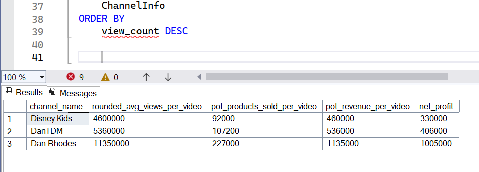

# Data-Driven Influencer Selection for YouTube Marketing Campaigns 


# Table of contents 

- [Objective](#objective)
- [Data Source](#data-source)
- [Stages](#stages)
- [Design](#design)
  - [Dashboard components](#dashboard-components)
  - [Tools](#tools)
- [Development](#development)
  - [End-to-End Approach](#end-to-end-approach)
  - [Data Exploration](#data-exploration)
  - [Data Cleaning](#data-cleaning)
  - [Transform the Data](#transform-the-data)
  - [Create the SQL View](#create-the-sql-view)
- [Data Validation](#data-validation)
- [Visualization](#visualization)
  - [Dashboard](#dashboard)
  - [DAX Measures](#dax-measures)
- [Analysis](#analysis)
  - [Findings](#findings)
  - [Profitability Prediction](#profitability-prediction)
  - [Summary](#summary)
- [Recommendations](#recommendations)
  - [Potential ROI](#potential-roi)
  - [Action Plan](#action-plan)


# Objective 

**The Key Question** 

Which UK-based YouTubers are the top performers, and who are the most suitable candidates for partnership in upcoming marketing campaigns?
The Head of Marketing is looking to identify the top-performing YouTubers to determine the most suitable partners for marketing campaigns planned for the remainder of the year.

**The Ideal Solution**

A dynamic, insight-driven dashboard that profiles leading UK YouTubers based on key metrics—subscriber count, total views, video output, and engagement rate. 
This dashboard will empower the marketing team to make informed, data-backed decisions when selecting YouTubers for collaboration, ensuring optimal reach and audience alignment.

# Data Source 

To support the analysis, we require data on the top UK-based YouTubers, specifically including the following attributes:
- Channel names
- Total subscribers
- Total views
- Total videos uploaded

The dataset is sourced from Kaggle. It includes information on the top 100 social media influencers by country for 2024. [Kaggle](https://www.kaggle.com/datasets/bhavyadhingra00020/top-100-social-media-influencers-2024-countrywise?resource=download)

# Stages

- Design
- Development
- Data Validation
- Analysis 
 

# Design 

## Dashboard components
To determine the dashboard's content, we first identify the key business questions it needs to answer. These questions guide the design and ensure the dashboard delivers relevant and actionable insights.
1. Who are the top 10 YouTubers by subscriber count?
2. Which 3 channels have the highest total views?
3. Which 3 channels have the highest average views per video?
4. Which 3 channels have the highest views per subscriber ratio?
5. Which 3 channels have the highest subscriber engagement per video uploaded?
   

## Tools 

| Tool | Purpose |
| --- | --- |
| Excel | Exploring the data |
| SQL Server | Cleaning, testing, and analysing the data |
| Power BI | Visualising the data via interactive dashboards |
| GitHub | Hosting the project documentation and version control |


# Development

## End-to-End Approach

1. Data Collection
  Acquire relevant YouTube channel data, focusing on UK-based creators and key performance metrics.

2. Initial Exploration
  Conduct a preliminary review and analysis of the raw data in Excel to identify structure, completeness, and potential anomalies.

3. Data Loading
  Import the dataset into SQL Server to enable structured querying and efficient data handling.

4. Data Cleaning
  Use SQL to clean and transform the data, handling missing values, correcting inconsistencies, and preparing it for analysis.

5. Data Testing
  Validate data accuracy and consistency through SQL-based testing and integrity checks.

6. Data Visualisation
  Connect SQL Server to Power BI to build an interactive dashboard showcasing metrics like subscriber count, total views, video volume, and engagement.

7. Insight Generation
  Analyse trends and relationships within the visualised data to derive actionable insights for marketing decision-making.

8. Documentation & Commentary
  Document the process, methods, and key findings, including explanations for insights and any assumptions made.

9. Publishing
  Publish the final dashboard and supporting documentation to GitHub Pages for easy access and sharing.


## Data Exploration

A preliminary review of the dataset revealed the following key points:

1. Sufficient Core Metrics
The dataset includes at least four essential columns: subscriber count, total views, number of videos, and engagement-related data. These cover all core metrics required for our analysis, meaning no further data collection from the client is necessary at this stage.

2. Channel Identification Format
The first column appears to contain YouTube channel identifiers in a format that includes the @ symbol, likely representing channel handles. For clarity and usability, we’ll extract and clean these to display proper channel names throughout the analysis.

3. Language Inconsistencies
Some column headers and cell values are in a language other than English. We'll assess whether these fields are relevant. If they are, translation or standardisation will be required; otherwise, they’ll be excluded from the analysis.

4. Unnecessary Columns
The dataset contains more fields than needed for our specific objectives. To improve clarity and focus, non-essential columns will be removed during the data cleaning process, allowing us to streamline both analysis and visualisation.


## Data Cleaning 
The goal of the cleaning phase is to ensure the dataset is structured, consistent, and fully ready for analysis. To achieve this, the cleaned dataset should meet the following criteria and constraints:
1. Relevant Fields Only
Retain only the columns essential to the analysis, such as channel name, subscriber count, total views, video count, and engagement metrics.

2. Correct Data Types
Ensure that each column has an appropriate data type (e.g., integers for numerical metrics, strings for text fields) to support accurate filtering, aggregation, and visualisation.

3. No Missing Values
All rows should contain complete data across the retained columns. There should be no null or blank values to ensure the reliability of any derived insights.

Below is a table outlining the constraints on our cleaned dataset:

| Property | Value |
| --- | --- |
| Number of Rows | 100 |
| Number of Columns | 4 |

And here is a tabular representation of the expected schema for the clean data:

| Column Name | Data Type | Nullable |
| --- | --- | --- |
| channel_name | VARCHAR | NO |
| total_subscribers | INTEGER | NO |
| total_views | INTEGER | NO |
| total_videos | INTEGER | NO |

### Transform the data 
```sql
/*

Data Cleaning
1. Select only the required columns
3. Rename column names

*/

SELECT 
	channel_name,
	total_subscribers AS subscriber_count,
	total_views AS view_count,
	total_videos AS video_count 
FROM 
	top_uk_youtubers
```


### Create the SQL view 

```sql
CREATE VIEW view_uk_youtubers AS

SELECT 
	channel_name,
	total_subscribers AS subscriber_count,
	total_views AS view_count,
	total_videos AS video_count 
FROM 
	top_uk_youtubers

```


# Data Validation 
The following data quality checks were conducted

## 1. Row count check
```sql
SELECT 
	COUNT(*) AS num_row
FROM 
	view_uk_youtubers
```
### Output


## 2. Column count check 
```sql
SELECT 
	COUNT(*) AS num_column
FROM 
	INFORMATION_SCHEMA.COLUMNS
WHERE 
	TABLE_NAME = 'view_uk_youtubers'
```
### Output


## 3. Data type check
```sql
SELECT 
	COLUMN_NAME,
	DATA_TYPE
FROM 
	INFORMATION_SCHEMA.COLUMNS
WHERE 
	TABLE_NAME = 'view_uk_youtubers'
```
### Output


## 4. Duplicate count check 
```sql
SELECT
	COUNT(DISTINCT(channel_name)) AS channel_count
FROM
	view_uk_youtubers
```
### Output


# Visualization 
## Dashboard


## DAX Measures

### 1. Total Subscribers
```
Total Subscribers (Million) =
DIVIDE(
  SUM(view_uk_youtubers[subscriber_count]),
  1000000
)
```

### 2. Total Views
```
Total Views (Billion) =
DIVIDE(
  SUM(view_uk_youtubers[view_count]),
  1000000000
)
```

### 3. Average Views Per Video
```
Average Views per Video (Million) = 
DIVIDE(
	SUM('view_uk_youtubers'[view_count]),
	SUM('view_uk_youtubers'[video_count]) * 1000000
)

```


### 4. Subscriber Engagement Rate
```
Subscriber Engagement = 
DIVIDE(
	SUM('view_uk_youtubers'[subscriber_count]),
	SUM('view_uk_youtubers'[video_count])
)

```


### 5. Views per subscriber
```
Views per Subscriber = 
DIVIDE(
	SUM('view_uk_youtubers'[view_count]),
	SUM('view_uk_youtubers'[subscriber_count])
)

```


# Analysis 

## Findings

To provide targeted insights for our marketing client, we will concentrate on answering the following key questions:


### 1. Who are the top 10 YouTubers with the most subscribers?

| Rank | Channel Name         | Subscribers (Million) |
|------|----------------------|-----------------|
| 1    | NoCopyrightSounds    | 33.60           |
| 2    | DanTDM               | 28.60           |
| 3    | Dan Rhodes           | 26.50           |
| 4    | Miss Katy            | 24.50           |
| 5    | Mister Max           | 24.40           |
| 6    | KSI                  | 24.10           |
| 7    | Jelly                | 23.50           |
| 8    | Dua Lipa             | 23.30           |
| 9    | Sidemen              | 21.00           |
| 10   | Ali-A                | 18.90           |


### 2. Which 3 channels have the most views?


| Rank | Channel Name | Total Views (Billion) |
|------|--------------|-----------------|
| 1    | DanTDM       | 19.78           |
| 2    | Dan Rhodes   | 18.56           |
| 3    | Mister Max   | 15.97           |


### 3. Which 3 channels have the highest average views per video?

| Channel Name | Average Views per Video (Million) |
|--------------|-----------------|
| Mark Ronson  | 32.27           |
| Jessie J     | 5.97            |
| Dua Lipa     | 5.76            |


### 4. Which 3 channels have the highest views per subscriber ratio?

| Rank | Channel Name       | Views per Subscriber        |
|------|-----------------   |---------------------------- |
| 1    | GRM Daily          | 1185.79                     |
| 2    | Nickelodeon        | 1061.04                     |
| 3    | Disney Junior UK   | 1031.97                     |


### 5. Which 3 channels have the highest subscriber engagement rate per video uploaded?

| Rank | Channel Name    | Subscriber Engagement Rate  |
|------|-----------------|---------------------------- |
| 1    | Mark Ronson     | 343,000                     |
| 2    | Jessie J        | 110,416.67                  |
| 3    | Dua Lipa        | 104,954.95                  |


## Profitability Prediction  

### 1. Youtubers with the most subscribers 

#### Calculation breakdown

**Campaign idea -  Product Placement**
- Product cost is assumed to be £5
- Campaign cost is assumed to be £50,000
- Conversion rate is assumed to be 2%
  
1. NoCopyrightSounds 
- Average views per video = 6.92 million
- Product cost = £5
- Potential units sold per video = 6.92 million x 2% conversion rate = 138,400 units sold
- Potential revenue per video = 138,400 x £5 = £692,000
- Campaign cost (one-time fee) = £50,000
- **Net profit = £692,000 - £50,000 = £642,000**

b. DanTDM

- Average views per video = 5.34 million
- Product cost = £5
- Potential units sold per video = 5.34 million x 2% conversion rate = 106,800 units sold
- Potential revenue per video = 106,800 x £5 = £534,000
- Campaign cost (one-time fee) = £50,000
- **Net profit = £534,000 - £50,000 = £484,000**

c. Dan Rhodes

- Average views per video = 11.15 million
- Product cost = £5
- Potential units sold per video = 11.15 million x 2% conversion rate = 223,000 units sold
- Potential revenue per video = 223,000 x £5 = £1,115,000
- Campaign cost (one-time fee) = £50,000
- **Net profit = £1,115,000 - £50,000 = £1,065,000**


Best option from category: Dan Rhodes


#### SQL query 

```sql
/*

1. Define the variables
2. Create a CTE that calculates the average views per video
3. Select the necessary columns
4. Filter the result to get the top three most subscribed channels

*/

-- Step 1
DECLARE @conversion_rate FLOAT = 0.02;		 -- Conversion rate is 2%
DECLARE @product_cost MONEY = 5.0;			 -- Product cost is £5
DECLARE @campaign_cost MONEY = 50000.0;		 -- Campaign cost is £50000


-- Step 2
WITH ChannelInfo AS (
	SELECT 
		channel_name,
		subscriber_count,
		view_count,
		video_count,
		ROUND((CAST(view_count AS FLOAT)/video_count), -4) AS rounded_avg_views_per_video
	FROM
		view_uk_youtubers

)

-- Top 3 most subscribed channels
SELECT TOP 3
	channel_name,
	rounded_avg_views_per_video,
	(rounded_avg_views_per_video * @conversion_rate) AS pot_products_sold_per_video,
	(rounded_avg_views_per_video * @product_cost) AS pot_revenue_per_video,
	(rounded_avg_views_per_video * @product_cost - @campaign_cost) AS net_profit
FROM 
	ChannelInfo
ORDER BY 
	subscriber_count DESC;
```

#### Output


### 2.  Youtubers with the most views 

#### Calculation breakdown

**Campaign idea - Influencer marketing**
- Campaign cost is assumed to be £130,000
- Conversion rate is assumed to be 2%

a. DanTDM

- Average views per video = 5.34 million
- Product cost = £5
- Potential units sold per video = 5.34 million x 2% conversion rate = 106,800 units sold
- Potential revenue per video = 106,800 x £5 = £534,000
- Campaign cost (3-month contract) = £130,000
- **Net profit = £534,000 - £130,000 = £404,000**

b. Dan Rhodes

- Average views per video = 11.15 million
- Product cost = £5
- Potential units sold per video = 11.15 million x 2% conversion rate = 223,000 units sold
- Potential revenue per video = 223,000 x £5 = £1,115,000
- Campaign cost (3-month contract) = £130,000
- **Net profit = £1,115,000 - £130,000 = £985,000**

c. Mister Max

- Average views per video = 14.06 million
- Product cost = £5
- Potential units sold per video = 14.06 million x 2% conversion rate = 281,200 units sold
- Potential revenue per video = 281,200 x £5 = £1,406,000
- Campaign cost (3-month contract) = £130,000
- **Net profit = £1,406,000 - £130,000 = £1,276,000**

Best option from category: Mister Max


#### SQL query 
```sql
/*

1. Define the variables
2. Create a CTE that calculates the average views per video
3. Select the necessary columns
4. Filter the result to get the top three channels with the most views

*/

-- Step 1
DECLARE @conversion_rate FLOAT = 0.02;		 -- Conversion rate is 2%
DECLARE @product_cost MONEY = 5.0;			 -- Product cost is £5
DECLARE @campaign_cost MONEY = 50000.0;		 -- Campaign cost is £50000


-- Step 2
WITH ChannelInfo AS (
	SELECT 
		channel_name,
		subscriber_count,
		view_count,
		video_count,
		ROUND((CAST(view_count AS FLOAT)/video_count), -4) AS rounded_avg_views_per_video
	FROM
		view_uk_youtubers

)

-- Top 3 channels with the most views
SELECT TOP 3
	channel_name,
	rounded_avg_views_per_video,
	(rounded_avg_views_per_video * @conversion_rate) AS pot_products_sold_per_video,
	(rounded_avg_views_per_video * @product_cost) AS pot_revenue_per_video,
	(rounded_avg_views_per_video * @product_cost - @campaign_cost) AS net_profit
FROM 
	ChannelInfo
ORDER BY 
	view_count DESC	
```

#### Output




## Summary

1. Top UK YouTubers by Subscribers
NoCopyrightSounds, Dan Rhodes, and DanTDM lead the UK in subscriber count.

2. Top UK YouTubers by Views
DanTDM, Dan Rhodes, and Mister Max have the highest total views.

3. Channel Type Insights
Entertainment and music-focused channels dominate engagement and reach. These creators publish consistently and maintain high levels of audience interaction, making them ideal for broad marketing campaigns.


## Recommendations 

1. Dan Rhodes is the strongest candidate for collaboration if the goal is to maximise visibility. He currently has the highest subscriber count among UK YouTubers.

2. Mister Max offers excellent reach potential. However, for longer-term impact, DanTDM and Dan Rhodes may be better partners due to their large subscriber bases and strong average view counts.

3. Based on consistent engagement and overall performance, the top three channels to partner with are:
- NoCopyrightSounds
- DanTDM
- Dan Rhodes

### Potential ROI 
1. Dan Rhodes collaboration: Estimated net profit: £1,065,000 per video

2. Mister Max influencer campaign: Estimated net profit: £1,276,000

3. DanTDM
- Product placement campaign: £484,000 per video
- Influencer partnership deal: £404,000 net profit (one-off)

4. NoCopyrightSounds collaboration: Estimated profit: £642,000 per video 


### Action plan
We recommend pursuing a long-term influencer partnership with Dan Rhodes, given his extensive reach, consistent engagement, and high ROI potential.

After confirming this strategy aligns with the client’s expectations, we can look to expand collaborations with DanTDM, Mister Max, and NoCopyrightSounds based on campaign results and performance tracking.   

1. Initiate Contact
Reach out to Dan Rhodes’ team first to explore partnership opportunities.

2. Negotiate Terms
Align collaboration agreements with campaign budgets and expected deliverables.

3. Launch Campaigns
Begin with the agreed influencer content, tracking performance through defined KPIs.

4. Review and Optimise
Evaluate each campaign’s performance, collect feedback from target audiences, and refine the strategy for future partnerships.


